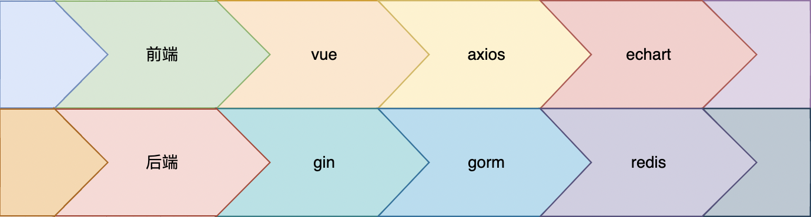

# 中国餐饮数据大屏显示

---



---

```apl
前端
src

-|views

-|-|data
-|-|-|Screen.vue // 大屏显示

-|-|login
-|-|-|login.vue // 登录页

-| Web

-|-|Api1.js // APi1接口数据获取和转换
-|-|Api2.js // APi2接口数据获取和转换
-|-|Api3.js // APi3接口数据获取和转换
-|-|Api4.js // APi4接口数据获取和转换
-|-|Api5.js // APi5接口数据获取和转换
-|-|ApiUser.js // whoAmI接口数据获取和转换

-| assests
-|-| background.jpeg //背景图片
```

---

```apl
后端
-| main.go

-| dao // 数据库连接与初始化
-|-| mysql.go // 关系型数据库 mysql 连接与初始化
-|-| redis.go // 非关系型数据库 redis 连接与初始化

-| manager // 封装 service 层对数据的操作
-|-| Api1GetChineseCateringStatistic 
	// 封装 Api1 对数据库 chinese_catering_statistics 的操作
-|-| Api2GetChineseCateringOnlineOrderStatistic
	// 封装 Api2 对数据库 chinese_catering_online_order_statistics 的操作
-|-| Api3GetChineseCateringPayment
	// 封装 Api3 对数据库 chinese_catering_payments 的操作
-|-| Api4GetChineseCateringBrandStatistic
	// 封装 Api4 对数据库 chinese_catering_brand_statistics 的操作
-|-| Api5GetChineseCateringFundingStatistic
	// 封装 Api5 对数据库 chinese_catering_funding_statistics 的操作
-|-| ApiUserChineseCateringUser
	// 封装 ApiUsers 对数据库 chinese_catering_users 的操作
	
-| middlewares // 配置跨域访问
-|-| middlewares.go

-| router // 路由设置
-|-| router.go

-| service // 提供后端接口
-|-| Api1.go // 提供后端接口 api1
-|-| Api2.go // 提供后端接口 api2
-|-| Api3.go // 提供后端接口 api3
-|-| Api4.go // 提供后端接口 api4
-|-| Api5.go // 提供后端接口 api5
-|-| ApiUsers
-|-|-| Create.go // 提供后端接口 create
-|-|-| LoginByPassword.go // 提供后端接口 loginBypassword
-|-|-| LoginBySession.go // 提供后端接口 loginBySession
-|-|-| WhoAmI.go // 提供后端接口 whoAmI

-| types // 类型
-|-| Api1.go // 接口 api1 相关的类
-|-| Api2.go // 接口 api2 相关的类
-|-| Api3.go // 接口 api3 相关的类
-|-| Api4.go // 接口 api4 相关的类
-|-| Api5.go // 接口 api5 相关的类
-|-| AqiUsers.go // 所有用户类的接口相关的类
-|-| types.go // ErrNo等常量

```


## 1. 功能

### 1. 登录页


*   (免登录直接跳转数据页)
*   提示预先写入的用户数据(独立模块可拆卸)
*   收集登录信息，提供 3 天没登录选项，提供登录按键
*   提供注册按键

### 2. 注册页

*   登录页的另一种形式


*   收集用户信息，提供注册按键
*   提供返回登录按键

### 3. 数据页


*   数据显示
*   用户信息显示
*   提供注销按键


## 2. 登录页相关功能实现

### 1. 终端显示层

*   页面切换
    *   `todo == "login" ` 显示登录页(以及提示)
    *   `todo == "register"` 显示注册页
*   数据收集

### 2. 请求处理层(web层)

#### 1. 免登录

1.   从 Cookie 读取 SessionKey， 若不为空发送至 **<u>*loginBySession*</u>** 接口，并接受返回的数据 res；为空结束
2.   若 `res.data.Code==0`(后端正常处理)，从 res 中读取用户 Id 并作为参数跳转至数据页；反之结束

```js
let that = this
let SessionKey = this.$cookies.get("camp-session")
if (SessionKey) {
    axios.post(
        "http://127.0.0.1:1432/api/v1/loginBySession?",{                        
            SessionKey: SessionKey
        }
    ).then(function(res){
        if (res.data.Code == 0 ){
            that.Id = res.data.Data.Id
            that.jumpTo()
        } else {

        }
    }).catch(function(err){
        console.log(err)
    })
}
```


```js
jumpTo(){
    let that = this
    this.$router.push({
        path: `/data/Screen`,
        query: {
            Id: that.Id
        },
    })
}
```


#### 2. 登录

1.    检测用户舒服输入用户名和密码；若无提示用户输入，结束函数
2.    将用户名和密码发送至 *<u>**loginByPassword**</u>* 接口，并接受返回数据 res
3.    若 `res.data.Code==0`，从 res 中读取用户 Id；反之提示用户 “用户名或密码错误”，结束函数
4.    若用户选择 3天免登录，则从 res 中读取 SessionKey 并写入Cookie，反之直接进入下一步
5.    将用户作为参数 Id 转发至数据页


```js
login(){
    if ( this.Username=="" || this.Password=="") {
        alert("请输入用户名或密码")
    } else {
        let that = this
        axios.post(
            "http://127.0.0.1:1432/api/v1/loginByPassword?",{                        
                Username : this.Username, 
                Password : this.Password,
            }
        ).then(function(res){
            if (res.data.Code == 0 ){
                that.Id = res.data.Data.Id
                if (that.setCookie == 'true'){
                    that.$cookies.set("camp-session", res.data.Data.Session)                  
                }
                that.jumpTo()
            } else {
                alert("账号或密码错误")
            }
        }).catch(function(err){
            console.log(err)
        })
    }
}
```


#### 3. 注册

1.   检测用户是否输入所有信息；若无提示用户输入，结束函数
1.   将数据发送至 **<u>*create*</u>** 接口，并接收返回数据 res
1.   若 `res.data.Code==0` 提示注册成功，跳转至登录页；反之提示用户已存在


```js
register(){
    if ( this.Username=="" || this.Password=="" || this.RealName=="") {
        alert("请输入完整信息")
        return
    }
    let that = this
    axios.post(
        "http://127.0.0.1:1432/api/v1/create",{
            Username: this.Username,
            Password: this.Password,
            Identity: this.Identity,
            RealName :this.RealName
        }
    ).then(function(res){
        if (res.data.Code == 0 ){
            alert("注册成功")
            that.todo = "login"        
        } else {
            alert("用户已存在")
        }
    }).catch(function(err){
        console.log(err)
    })
}
```


### 3. 业务逻辑层(Service层)

#### 1. loginBySession接口

1.   从请求中读取 require
2.   通过 require.SessionKey 从 **<u>*Redis*</u>** 读取 username 若读取失败结束函数
3.   将  username 作为参数，通过 manager 层 `SelectUser(Username string)` 读取用户的数据 data
4.   通过 require.SessionKey 从 **<u>*Redis*</u>** 读取 password 若读取失败结束函数
5.   若 `data.Password == password` 返回 用户 Id


```go
type LoginRequest struct {
	Username   string
	Password   string
	SessionKey string
}

type LoginResponse struct {
	// 密码错误范围密码错误状态码
	Code ErrNo
	Data struct {
		Session string
		Id      uint
	}
}
```


```go
func LoginBySession(c *gin.Context) {

	var request types.LoginRequest
	if err := c.ShouldBind(&request); err != nil {
		log.Println(err)
		return
	}

	username, err := dao.RDB.HGet(request.SessionKey, "Username").Result()
	if err != nil {
		c.JSON(200, types.LoginResponse{
			Code: types.UnknownError,
		})
		return
	}

	data := manager.SelectUser(username)
	if data == (types.ChineseCateringUser{}) {
		c.JSON(200, types.LoginResponse{
			Code: types.WrongPassword,
		})
		return
	}

	password, err := dao.RDB.HGet(request.SessionKey, "Password").Result()
	if err != nil {
		c.JSON(200, types.LoginResponse{
			Code: types.UnknownError,
		})
		return
	}

	if password == data.Password {
		c.JSON(200, types.LoginResponse{
			Code: types.OK,
			Data: struct {
				Session string
				Id      uint
			}{Session: "", Id: data.Id},
		})
	} else {
		c.JSON(200, types.LoginResponse{
			Code: types.WrongPassword,
		})
	}

}
```

#### 2. loginByPassword 接口

1.   从 require 中读取 Username 和 Password
2.   将用户名作为参数，通过 manager 层 `SelectUser(Username string)` 读取用户的数据 data
3.   若 `data.Password != require.Password` 返回 ErrNo ，结束函数
4.   随机生成 SessionKey
5.   通过 SessionKey 将 Username 和 Password 写入 **<u>*Redis*</u>**
6.   返回 SessionKey 和 Id

```go
func LoginByPassword(c *gin.Context) {

	var request types.LoginRequest
	if err := c.ShouldBind(&request); err != nil {
		log.Println(err)
		return
	}

	data := manager.SelectUser(request.Username)
	if data == (types.ChineseCateringUser{}) {
		c.JSON(200, types.LoginResponse{
			Code: types.WrongPassword,
		})
	}

	request.Password = dao.MD5(request.Password)
	if request.Password != data.Password {
		c.JSON(200, types.LoginResponse{
			Code: types.WrongPassword,
		})
	}

	// 获取唯一标识符 uuid 作为该数据行的键
	sessionKey := uuid.NewV4().String()

	if err := dao.RDB.HSet(sessionKey, "Username", data.Username).Err(); err != nil {
		log.Fatal(err)
		return
	}
	if err := dao.RDB.HSet(sessionKey, "Password", data.Password).Err(); err != nil {
		log.Fatal(err)
		return
	}
	// 设置 3 天的存储时间
	_, err := dao.RDB.Expire(sessionKey, 3*24*3600*time.Second).Result()
	if err != nil {
		return
	}

	response := types.LoginResponse{
		Code: types.OK,
		Data: struct {
			Session string
			Id      uint
		}{Session: sessionKey, Id: data.Id},
	}

	c.JSON(200, response)
}

```

#### 3. create 接口

1.   从请求中读取 require 数据
2.   将 require.Username 作为参数，通过 manager 层 `SelectUser(Username string)` 读取用户的数据 data
3.   若用户存在，返回 ErrNo
4.   将 require 数据转化成对应的用户数据后通过 manager 层 `InsertUser(data types.ChineseCateringUser)` 写入数据度
5.   将 require.Username 作为参数，通过 manager 层 `SelectUser(Username string)` 读取用户的数据 data
6.   返回用户 Id

```go
type CreateMemberRequest struct {
	Username string
	Password string
	RealName string
	Identity string
}

type CreateMemberResponse struct {
	Code ErrNo
	Data struct {
		Id uint
	}
}
```


```go
func CreateMember(c *gin.Context) {
	var request types.CreateMemberRequest
	if err := c.ShouldBind(&request); err != nil {
		log.Println(err)
		return
	}

	data := manager.SelectUser(request.Username)
	if data != (types.ChineseCateringUser{}) {
		c.JSON(200, types.CreateMemberResponse{Code: types.UserHasExisted})
		return
	}

	manager.InsertUser(types.ChineseCateringUser{
		Username: request.Username,
		Password: dao.MD5(request.Password),
		RealName: request.RealName,
		Identity: request.Identity,
	})
	data = manager.SelectUser(request.Username)

	c.JSON(200, types.CreateMemberResponse{
		Code: types.OK,
		Data: struct{ Id uint }{Id: data.Id},
	})

}

```

### 4. 通过处理层(manager层)与数据类

```go
type ChineseCateringUser struct {
	Id       uint   `gorm:"primaryKey;type:bigint UNSIGNED not null AUTO_INCREMENT"`
	Username string `gorm:"VARCHAR(255) NULL DEFAULT NULL"`
	Password string `gorm:"VARCHAR(255) NULL DEFAULT NULL"`
	RealName string `gorm:"VARCHAR(255) NULL DEFAULT NULL"`
	Identity string `gorm:"enum(0,1,2,3) NULL DEFAULT NULL"`
}

```


```go
func SelectUser(Username string) types.ChineseCateringUser {
	var data types.ChineseCateringUser

	dao.DB.Where("username=?", Username).Find(&data)

	return data
}

func InsertUser(data types.ChineseCateringUser) {
	dao.DB.Create(&data)
}
```

## 3. 数据页相关功能实现

### 1. 前端

#### 1. logout

1.   删除本地 Cookie 值
2.   跳转登录页

#### 2. 数据显示

*   根据显示要求，向接口发送请求数据，然后将接口返回的数据转化为可视化数据
*   以 Api2 为例


```js
// src/Web/Api2.js
import axios from 'axios'
function getApi2Data (callback){
    axios.post(
        "http://127.0.0.1:1432/api/v1/api2?BeginYear=2010&EndYear=2021"
    ).then( function(res){
        if (res.data.Code == 0){
            callback({
                Data: {
                    title:{
                        text:"2010年-2021年中国餐饮线上订单走势",
                    },
                    xAxis: {
                        type: 'category',
                        data: res.data.AllTime
                    },
                    yAxis: {
                        type: 'value'
                    },
                    series: [
                        {
                            data: res.data.AllOrderAmount,
                            type: 'line',
                            smooth: true,
                            color:'#5555AA',
                        }
                    ]
                }
            })
        }
    }).catch(function(err){
        console.log(err)
    })
}
export{
	getApi2Data,
}
```


```js
// src/views/data/Screen.vue
import {getApi2Data} from '../../Web/Api2'

...

Api2(){
    getApi2Data((res) =>{
        this.Api2Op = res.Data
    })
},
```


#### 3. 用户信息显示

1.   获取登录页传递的用户Id
2.   将用户Id作为参数发送到 ***whoAmI***  接口，并接收返回值 res，并将结果写入 whoAmI 变量

```js
src/Web/ApiUser.js
import axios from 'axios'

function getWhoAmIData(Id, callback){
    axios.post(
        "http://127.0.0.1:1432/api/v1/whoAmI?",{                        
            Id : Id
        }
    ).then(function(res){
        if (res.data.Code == 0 ){
            let data = {}
            data.Id  = Id,
            data.Username = res.data.Data.Username
            data.RealName = res.data.Data.RealName
            data.Identity = res.data.Data.Identity
            callback({Data:data})
        } else {
            callback({Data:{}})
        }
    }).catch(function(err){
        console.log(err)
    })
}

export{
	getWhoAmIData
}
```


```js
// src/views/data/Screen.vue
import * as ApiUser from '../../Web/ApiUser'

...

ApiUser.getWhoAmIData(this.$route.query.Id , (res)=>{
    this.whoAmI = res.Data
})
```


### 2. 后端

#### 1. whoAmI 接口

1.   从请求中读取 require 数据
2.   通过 require.Id读取用户数据 data
3.   将 data 中用户吗 真实姓名 用户类型返回

```go
type WhoAmIRequest struct {
	Id string
}

type WhoAmIResponse struct {
	Code ErrNo
	Data struct {
		Username string
		RealName string
		Identity string
	}
}
```


```go
func WhoAmI(c *gin.Context) {
	var request types.WhoAmIRequest
	if err := c.ShouldBind(&request); err != nil {
		log.Println(err)
		return
	}

	var data types.ChineseCateringUser
	dao.DB.Where("Id = ?", request.Id).Find(&data)

	c.JSON(200, types.WhoAmIResponse{
		Code: types.OK,
		Data: struct {
			Username string
			RealName string
			Identity string
		}{
			Username: data.Username,
			RealName: data.RealName,
			Identity: data.Identity,
		},
	})
}
```


#### 2. Api1 接口

1.   从请求中读取 require 数据
2.   以从 require.BeginYear 到 require.EndYear 中的每一年 year 作为参数，从数据库中读取 total_amount 和 total_amount_percentage，并以此添加到 response 中
3.   返回 response

##### 1. types

```go
package types

// ChineseCateringStatistic
// Table5
type ChineseCateringStatistic struct {
	Id                    string  `gorm:"primaryKey BIGINT NOT NULL AUTOINCREMENT"`
	Year                  int     `gorm:"INT NULL DEFAULT NULL"`
	TotalAmount           float64 `gorm:"FLOAT NULL DEFAULT NULL"`
	TotalAmountPercentage float64 `gorm:"FLOAT NULL DEFAULT NULL"`
}

type Api1Request struct {
	BeginYear int
	EndYear   int
}

type Api1Data struct {
	Year                  int
	TotalAmount           string
	TotalAmountPercentage string
}

type Api1Response struct {
	Code ErrNo
	Data []Api1Data
}

```

##### 2. Service

```go
func Api1(c *gin.Context) {
	var request types.Api1Request
	if err := c.ShouldBind(&request); err != nil {
		log.Println(err)
		return
	}

	var response types.Api1Response
	for year := request.BeginYear; year <= request.EndYear; year++ {
		response.Data = append(response.Data, manager.GetChineseCateringStatistic(year))
	}

	c.JSON(200, response)

}
```

##### 3. Manager

```go
func GetChineseCateringStatistic(year int) types.Api1Data {
	var sqlData types.Api1Data
	sqlData.Year = year

	sqlStr := `
		SELECT total_amount, total_amount_percentage  
		From chinese_catering_statistics
		WHERE year = ?
	`
	dao.DB.Raw(sqlStr, year).Scan(&sqlData)

	return sqlData
}
```


#### 3. Api2 接口

1.   从请求中读取 require 数据
2.   以从 require.BeginYear 到 require.EndYear 中的每一年 year 作为参数，从数据库中读取 order_amount，并以此添加到 response 中
3.   返回 response

##### 1. types

```go
package types

// ChineseCateringOnlineOrderStatistic
// Table3
type ChineseCateringOnlineOrderStatistic struct {
	Id          string `gorm:"primaryKey BIGINT NOT NULL AUTOINCREMENT"`
	Year        int    `gorm:"INT NULL DEFAULT NULL"`
	Month       int    `gorm:"INT NULL DEFAULT NULL"`
	OrderAmount int    `gorm:"INT NULL DEFAULT NULL"`
}

type Api2Request struct {
	BeginYear int
	EndYear   int
}

type Api2Data struct {
	Time        string
	OrderAmount int
}

type Api2Response struct {
	Code           ErrNo
	AllTime        []string
	AllOrderAmount []int
}

```

##### 2. Service

```go
func Api2(c *gin.Context) {
	var request types.Api2Request
	if err := c.ShouldBind(&request); err != nil {
		log.Println(err)
		return
	}

	var response types.Api2Response
	for year := request.BeginYear; year <= request.EndYear; year++ {
		for month := 1; month <= 12; month++ {
			res := manager.GetChineseCateringOnlineOrderStatistic(year, month)
			response.AllTime = append(response.AllTime, res.Time)
			response.AllOrderAmount = append(response.AllOrderAmount, res.OrderAmount)
		}
	}

	c.JSON(200, response)

}
```

##### 3. Manager

```go
func GetChineseCateringOnlineOrderStatistic(year, month int) types.Api2Data {
	var sqlData types.Api2Data
	sqlData.Time = strconv.Itoa(year) + "-" + strconv.Itoa(month)

	sqlStr := `
		SELECT order_amount AS OrderAmount
		From chinese_catering_online_order_statistics
		WHERE year = ? AND month = ?
	`
	dao.DB.Raw(sqlStr, year, month).Scan(&sqlData)

	return sqlData
}
```

#### 2. Api3 接口

1.   从请求中读取 require 数据
2.   以从 require.BeginYear 到 require.EndYear 中的每一年 year 作为参数，从数据库中读取 `AVG( salary )` 和 `COUNT(*)`，并以此添加到 response 中
3.   返回 response

##### 1. types

```go
package types

// ChineseCateringPayment
// Table4
type ChineseCateringPayment struct {
	Id     string `gorm:"primaryKey BIGINT NOT NULL AUTOINCREMENT"`
	Year   int    `gorm:"INT NULL DEFAULT NULL"`
	Name   string `gorm:"VARCHAR(255) NULL DEFAULT NULL"`
	Salary int    `gorm:"INT NULL DEFAULT NULL"`
}

type Api3Request struct {
	BeginYear int
	EndYear   int
}

type Api3Data struct {
	Year        int
	AvgSalary   string
	CountSalary string
}

type Api3Response struct {
	Code ErrNo
	Data []Api3Data
}
```

##### 2. Service

```go
func Api3(c *gin.Context) {
	var request types.Api3Request
	if err := c.ShouldBind(&request); err != nil {
		log.Println(err)
		return
	}

	var response types.Api3Response
	for year := request.BeginYear; year <= request.EndYear; year++ {
		response.Data = append(response.Data, manager.GetChineseCateringPayment(year))
	}

	c.JSON(200, response)

}

```

##### 3. Manager

```go
func GetChineseCateringPayment(year int) types.Api3Data {
	var sqlData types.Api3Data
	sqlData.Year = year

	sqlStr := `
		SELECT AVG( salary ) AS avg_salary, COUNT(*) AS count_salary
		From chinese_catering_payments
		WHERE year = ?
	`
	dao.DB.Raw(sqlStr, year).Scan(&sqlData)

	return sqlData
}
```

#### 2. Api4 接口

1.   安装四个单词从数据库中读取所有品牌名称数组
2.   将字符串数组拼接为字符串并添加到 response 中
3.   返回 response

##### 1. types

```go
package types

// ChineseCateringBrandStatistic
// Table1
type ChineseCateringBrandStatistic struct {
	Id    string `gorm:"primaryKey BIGINT NOT NULL AUTOINCREMENT"`
	Brand string `gorm:"INT NULL DEFAULT NULL"`
	Other string `gorm:"VARCHAR(255) NULL DEFAULT NULL"`
}

type Api4Response struct {
	Code ErrNo
	Data []string
}

```

##### 2. Service

```go
func Api4(c *gin.Context) {
	response := struct {
		Code types.ErrNo
		Data []string
	}{}

	response.Data = append(response.Data, manager.GetChineseCateringBrandStatistic(0, 80))
	response.Data = append(response.Data, manager.GetChineseCateringBrandStatistic(80, 120))
	response.Data = append(response.Data, manager.GetChineseCateringBrandStatistic(120, 200))
	response.Data = append(response.Data, manager.GetChineseCateringBrandStatistic(200, 1000))

	c.JSON(200, response)
}

```

##### 3. Manager

```go
func GetChineseCateringBrandStatistic(minNum, maxNum int) string {

	var sqlData []string

	sqlStr := `
		SELECT brand
		From chinese_catering_brand_statistics
		WHERE ? <= price AND price < ? 
	`
	dao.DB.Raw(sqlStr, minNum, maxNum).Scan(&sqlData)

	return strings.Join(sqlData, "\n")
}

```

#### 2. Api5 接口

1.   从请求中读取 require 数据
2.   以从 require.EndYear 到 require.BeginYear 中的每一年 year 及其每一年中的 12月到 1月的每个月作为 month 作为参数，从数据库中读取全部数据 Data
3.   将 Data 中的每个 data 中的 Brand、FundingRound 和 Investor 提取出来与 Time 一起作为新的结构体数据添加到新的列表中
4.   将新的列表添加到 response 中
5.   返回 response

##### 1. types

```go
package types

// ChineseCateringFundingStatistic
// Table2
type ChineseCateringFundingStatistic struct {
	Id           string `gorm:"primaryKey BIGINT NOT NULL AUTOINCREMENT"`
	Brand        string `gorm:"VARCHAR(255) NULL DEFAULT NULL"`
	FundingYear  int    `gorm:"INT NULL DEFAULT NULL"`
	FundingMonth int    `gorm:"INT NULL DEFAULT NULL"`
	FundingRound string `gorm:"VARCHAR(255) NULL DEFAULT NULL"`
	Investor     string `gorm:"VARCHAR(255) NULL DEFAULT NULL"`
}

type Api5Response struct {
	Code ErrNo
	Data []struct {
		Time         string
		Brand        string
		FundingRound string
		Investor     string
	}
}

```

##### 2. Service

```go
func Api5(c *gin.Context) {

	var response types.Api5Response
	for year := 2022; year >= 2021; year-- {
		for month := 12; month >= 1; month-- {

			res := manager.GetChineseCateringFundingStatistic(year, month)
			for _, data := range res.Data {
				response.Data = append(response.Data, data)
			}
		}
	}

	c.JSON(200, response)

}
```

##### 3. Manager

```go
func GetChineseCateringFundingStatistic(year, month int) types.Api5Response {
	var sqlData []types.ChineseCateringFundingStatistic

	sqlStr := `
		SELECT *
		From chinese_catering_funding_statistics
		WHERE funding_year = ? AND funding_month = ?
	`
	dao.DB.Raw(sqlStr, year, month).Scan(&sqlData)
	str := strconv.Itoa(year) + "-" + strconv.Itoa(month)
	var res types.Api5Response
	for _, data := range sqlData {
		res.Data = append(res.Data, struct {
			Time         string
			Brand        string
			FundingRound string
			Investor     string
		}{Time: str, Brand: data.Brand, FundingRound: data.FundingRound, Investor: data.Investor})
	}

	return res
}
```

## 4. Router设置

### 1. router设置

```go
router/router.go
package router

import (
	"Back_Project/service"
	users "Back_Project/service/ApiUsers"

	"github.com/gin-gonic/gin"
)

func RegisterRouter(r *gin.Engine) {
	g := r.Group("api/v1")

	g.GET("/test", func(c *gin.Context) {
		c.JSON(200, gin.H{
			"msg": "hello gin",
		})
	})

	g.POST("/loginByPassword", users.LoginByPassword)
	g.POST("/loginBySession", users.LoginBySession)
	g.POST("/create", users.CreateMember)
	g.POST("/whoAmI", users.WhoAmI)
	g.POST("/api1", service.Api1)
	g.POST("/api2", service.Api2)
	g.POST("/api3", service.Api3)
	g.POST("/api4", service.Api4)
	g.POST("/api5", service.Api5)
}
```


### 2. 跨域设置

```go
// middlewares/middlewares.go
package middlewares

import (
	"net/http"

	"github.com/gin-gonic/gin"
)

// Cors
/**
 * 允许跨域访问
 */
func Cors() gin.HandlerFunc {
	return func(c *gin.Context) {
		method := c.Request.Method
		origin := c.Request.Header.Get("Origin")
		if origin != "" {
			c.Header("Access-Control-Allow-Origin", "*") // 可将将 * 替换为指定的域名
			c.Header("Access-Control-Allow-Methods", "POST, GET, OPTIONS, PUT, DELETE, UPDATE")
			c.Header("Access-Control-Allow-Headers", "Origin, X-Requested-With, Content-Type, Accept, Authorization")
			c.Header("Access-Control-Expose-Headers", "Content-Length, Access-Control-Allow-Origin, Access-Control-Allow-Headers, Cache-Control, Content-Language, Content-Type")
			c.Header("Access-Control-Allow-Credentials", "true")
		}
		if method == "OPTIONS" {
			c.AbortWithStatus(http.StatusNoContent)
		}
		c.Next()
	}
}

```

### main()

```go
func main() {
    	gin.SetMode(gin.ReleaseMode)
	g := gin.Default()
	g.Use(middlewares.Cors())
	router.RegisterRouter(g)
	err := g.Run(":1432")
	if err != nil {
		return
	}
}
```


## 5. 数据库设置

### 1. mysql

```go
package dao

import (
	"Back_Project/types"
	"crypto/md5"
	"fmt"
	"strings"
	"time"

	"gorm.io/driver/mysql"
	"gorm.io/gorm"
)

const (
	userName = "root"
	passWord = "12345678"
	ip       = "localhost"
	port     = "3306"
	dbName   = "Final_Project"
)

var DB *gorm.DB

func ConnectDb() {
	dsn := strings.Join([]string{userName, ":", passWord, "@tcp(", ip, ":", port, ")/", dbName, "?charset=utf8mb4&parseTime=True"}, "")

	fmt.Println("Connecting " + dbName)
	var err error
	DB, err = gorm.Open(mysql.Open(dsn), &gorm.Config{
		PrepareStmt: true,
	})

	if err != nil {
		fmt.Println("Open Database Fail")
		return
	}
	sqlDb, _ := DB.DB()
	// 设置空闲连接数
	// 数量 connections = ((core_count * 2) + effective_spindle_count)
	sqlDb.SetConnMaxIdleTime(10)
	// 最大连接数
	sqlDb.SetMaxOpenConns(100)
	// 连接复用连接时间
	sqlDb.SetConnMaxLifetime(time.Hour)
	fmt.Println("Mysql Connect Success")
}

/**
 * 创建销售表
 *
 */

// MD5
// 密码加密
func MD5(str string) string {
	data := []byte(str) //切片
	has := md5.Sum(data)
	md5str := fmt.Sprintf("%x", has) //将[]byte转成16进制
	return md5str
}

func InitUserTable() {
	// 删除 user
	if err := DB.Exec("DROP TABLE chinese_catering_users"); err != nil {
		fmt.Println(err)
	}
	if err := DB.AutoMigrate(&types.ChineseCateringUser{}); err != nil {
		return
	}
	DB.Create(&types.ChineseCateringUser{
		Username: "LocalHost",
		Password: MD5("127.0.0.1"),
		RealName: "Admin",
		Identity: types.Admin,
	})
	DB.Create(&types.ChineseCateringUser{
		Username: "Investor",
		Password: MD5("Investor"),
		RealName: "Investor",
		Identity: types.Investor,
	})
	DB.Create(&types.ChineseCateringUser{
		Username: "Practitioner",
		Password: MD5("Practitioner"),
		RealName: "Practitioner",
		Identity: types.Practitioner,
	})
	DB.Create(&types.ChineseCateringUser{
		Username: "Tourist",
		Password: MD5("Tourist"),
		RealName: "Tourist",
		Identity: types.Tourist,
	})
	fmt.Println("create table success")
}

```


### 2. redis

```go
package dao

import (
	"context"
	"fmt"

	"github.com/go-redis/redis"
)

var RDB *redis.Client

func InitRedis() {
	// 连接 Redis
	RDB = redis.NewClient(&redis.Options{
		Addr:     "127.0.0.1:6379",
		Password: "",  // no password set
		DB:       0,   // use default DB
		PoolSize: 100, // 连接池大小
	})

	// 利用根Context创建一个父Context
	_, cancel := context.WithCancel(context.Background())
	defer cancel()

	_, err := RDB.Ping().Result()

	if err != nil {
		fmt.Println("open redis fail")
		return
	}

	// 删除 redis 缓存
	res, err := RDB.FlushDB().Result()
	if err != nil {
		panic(err)
	}
	fmt.Println("delete redis:", res)

	// TODO 从数据库中提取剩余 Cap

	fmt.Println("open redis success")

}

```

### 3. main

```go
func main() {
    //Sql
	dao.ConnectDb()
	// 重置 User表
	dao.InitUserTable()

	// Redis
	dao.InitRedis()
}
```


## 6. 存在的问题和优化方向

### 1. 功能上

#### 1. 用户类型

*   预设了用户类型管理员，但是没有设计对应的用户管理等功能
    *   `TODO` 单独设置管理员的用户管理功能

#### 2. 数据显示

*   Api1、Api2、Api3、Api5的数据可以按照具体的时间访问进行访问，但是没有设置

    *   `TODO` 额外添加 input 收集开始和结束的具体时间，进行动态显示

*   `TODO`Api4 的数据可以按照分段具体显示

    

### 2. 前端上

*   几乎所有的布局都被设置在一个固定的位置，api5 的显示采用的 table 没有定制化的
    *   `TODO`优化当前的布局和显示

### 3. 后端上

*   所有数据交互都是线性的
    *   `TODO` 并发执行多个 manager 层函数，配合 Redis 完成对数据库的异步操作
*   `TODO` 建立 Redis 缓存，减少访问mysql的频率
